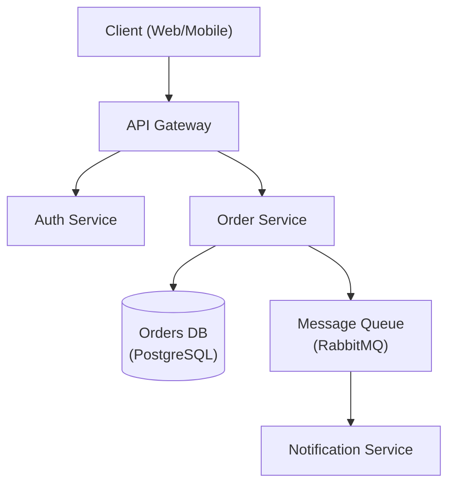

# Designer Catalog

Moved out of SKILL.md. Scope table, reference guide, constraints, output list, Mermaid example.

## When to Use / When Not to Use

| Use | Skip |
|-----|------|
| Designing new system topology from scratch | Internal layer dependency rule (use clean-architecture) |
| Choosing between monolith, modular monolith, microservices | Domain modeling with bounded contexts (use domain-driven-design) |
| Writing ADRs for major technology choices | Coding implementation (use spring-boot-engineer, kotlin-specialist) |
| Reviewing existing architecture for scalability | |

## Reference Guide

| Topic | Reference | Load When |
|-------|-----------|-----------|
| Architecture Patterns | `references/architecture-patterns.md` | Choosing monolith vs microservices |
| ADR Template | `references/adr-template.md` | Documenting decisions |
| System Design | `references/system-design.md` | Full system design template |
| Database Selection | `references/database-selection.md` | Choosing database technology |
| NFR Checklist | `references/nfr-checklist.md` | Gathering non-functional requirements |
| Diagram IR | `references/diagram-ir.md` | Drawing a system as an interactive, shareable HTML diagram |

## Constraints

**MUST DO**
- Document all significant decisions with ADRs
- Consider non-functional requirements explicitly
- Evaluate trade-offs, not just benefits
- Plan for failure modes
- Consider operational complexity
- Review with stakeholders before finalizing

**MUST NOT DO**
- Over-engineer for hypothetical scale
- Choose technology without evaluating alternatives
- Ignore operational costs
- Design without understanding requirements
- Skip security considerations
- Hand over a diagram HTML that `scripts/diagram.mjs check` has not passed

## Output Template

When designing architecture, provide:
1. Requirements summary (functional + non-functional)
2. High-level architecture diagram — Mermaid inline in a markdown doc; the IR + `diagram.mjs render` HTML (and its `.json` source) when it will be opened or shared
3. Key decisions with trade-offs (ADR format — see `references/adr-template.md`)
4. Technology recommendations with rationale
5. Risks and mitigation strategies

### Architecture Diagram (Mermaid)

For a worked ADR example and full template, see `references/adr-template.md`.
