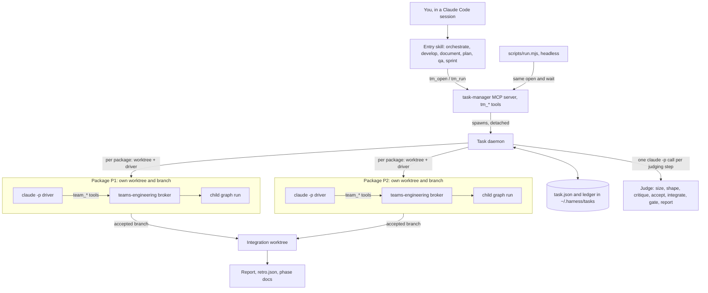
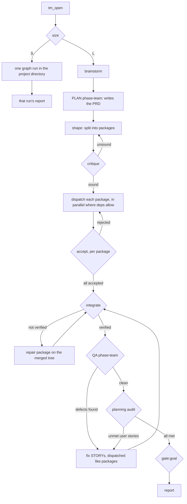
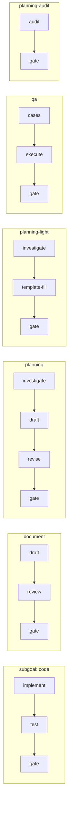
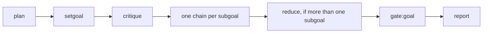
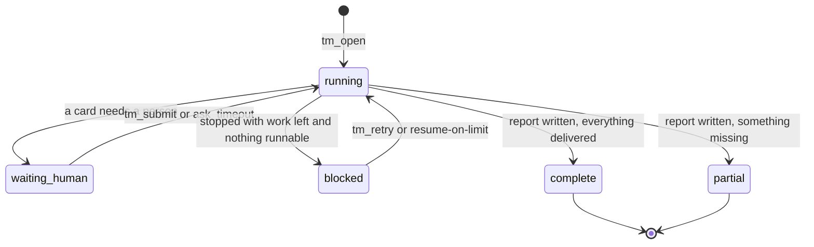

# teams

**English** · [한국어](KOR.md)

`teams` runs a request the way a small software team would. A request that is too big for one
pass is sized, planned, split into **packages** (one per piece of work), and each package is
handed to its own worker in its own git worktree. Every result is judged before it is accepted,
the accepted branches are merged into one integration tree, QA exercises the merged result, and a
final goal gate decides whether the request was actually met. You get a report either way. A
small request skips the whole manager layer and runs as one graph run.

Use `teams` when the work splits into parts, is not only code (a design doc, a PRD, a QA pass),
or should keep running after you close the session. Use [`graph`](../graph/README.md) for a
single code change you want to drive in one session.

| | `graph` | `teams` |
|---|---|---|
| Good for | one code request, one run | sized/split requests, documents, PRDs, QA, backlogs |
| MCP servers | `graph-engineering` (`graph_*`) | `teams-engineering` (`team_*`) + `task-manager` (`tm_*`) |
| Who drives | your session | a background daemon; your session only watches |
| Run files | `.harness-run/broker/` | `.teams_output/broker/` (runs), `~/.harness/tasks/` (tasks) |
| Version line | 1.x | 0.x |

Both can be enabled in the same project: the tool prefixes and run directories are distinct.

## How it fits together



- **task-manager** (`mcp/taskmanager.mjs`) owns a *task*: its node graph, packages, worktrees
  and verdicts. It never does the work itself, and it reads child run files without ever writing
  them.
- **The daemon** (`mcp/daemon.mjs`) is spawned by `tm_open` and outlives your session. It moves
  the task forward, calls a one-shot `claude -p` judge whenever a step needs judgment, and
  respawns dead or stalled drivers.
- **A driver** is a headless `claude -p` session that drives one package's child run through the
  `teams-engineering` broker (`mcp/broker.mjs`, `team_*` tools). The broker is the same engine
  lineage as `graph`.
- **Integration** merges accepted package branches into a separate integration worktree. teams
  never merges into your own branch; that tree is where the delivered work lives.

## One task, start to finish



What each step does:

| Step | What happens | Switch |
|---|---|---|
| `size` | A judge decides S (one run is enough) or L (split it). You can pin it with `size`. | — |
| `brainstorm` | Restates intent, scope and approach; asks you questions only when `interactive`. Skipped when your session already passed `decisions`. | `brainstorm` |
| PLAN | A planning team investigates the project and writes a PRD. With acceptance already declared in the request it runs a lighter chain. | `roles.planning` |
| `shape` → `critique` | `shape` splits the work into packages with `touches[]` and `deps`; `critique` checks the split. An unsound shape is reshaped. | — |
| dispatch → accept | Each package gets a worktree, a child run and a driver. When it finishes, a judge accepts or rejects it; a rejection retries the package with the reasons attached. | `max_retries`, `max_parallel_teams` |
| `integrate` | Merges the accepted branches and runs the checks. A seam no single package can see gets a repair package that works on the merged tree. | — |
| QA | A QA team writes and runs test cases against the merged tree. Each defect becomes a fix STORY, and the loop re-integrates. | `roles.qa`, `qa_rounds` |
| audit | Planning checks the merged result against its own PRD. Unmet stories are filed like QA defects. | `roles.audit` |
| `gate:goal` | Judges the whole result against the original request (`goal_threshold`, default 90%). | `goal_threshold` |
| `report` | Always runs once the goal gate settles, pass or fail. Also writes `retro.json` for the next Sprint. | — |

Every loop has a budget (`max_retries`, `qa_rounds`, `upstream_fix_rounds`). When one runs out,
the failure is *settled*: what depends on it is marked unreachable and the task goes on to its
report instead of hanging. A budget or timebox stop works the same way: nothing new is
dispatched, the accepted packages are integrated, and the rest is listed as "Next backlog".

Two more loops exist but are left out of the diagram: an integrate *conflict* (two packages
editing the same thing) needs `tm_retry({repackage})`, and a package that finds a bug in a
package it depends on files an **upstream fix** there and waits for it (`upstream_fix_rounds`).

## Inside one package

Each child run expands its subgoals into a node chain chosen by the subgoal's **kind**
(`KINDS` in `mcp/graph.mjs`). The author of a stage is never the one who judges it.



A rejected `gate` retries its subgoal with the gate's gaps as feedback. An interactive planning
run can stop after `investigate` with an `ask` card for you.

Which chain a run gets depends on its **flow**: `develop` → code, `document` → document,
`plan` → planning (or planning-light), `qa` → qa, and the post-QA audit → planning-audit. A
develop package that `shape` already planned runs *chain only*. Phase teams (PLAN, QA, audit),
repair packages, packages that shape marked for a further split, and the single run of a size-S
task get a full run around the chains:



## How a task ends



| State | Meaning |
|---|---|
| `running` | The daemon is working on it. |
| `waiting_human` | A card needs you: an `ask` question, a stage you took with `teams:take`, or a `human_gates` verdict. See `teams:inbox`. |
| `blocked` | It stopped with work left and nothing it can run on its own, for example a spent retry budget, a driver that kept dying, or a usage limit. `tm_retry` opens a fresh attempt. |
| `complete` | The report is written and everything was delivered. |
| `partial` | **New.** The report is written but something was not delivered: a package not accepted or never dispatched, integrate failed, QA or audit gave no verdict, `gate:goal` did not pass, or nodes were settled/unreachable. `partial_reasons: [...]` says what. |

## Quick start

**Install.** Install `teams@newkayak12-claude-skills`; that registers both MCP servers (reload
Claude Code if the `tm_*`/`team_*` tools do not show). `teams:install` is optional. It pins
project defaults in `.claude/team.json`, adds a dispatch gate, and adds `.claude/conventions/`.
Without it, the built-in defaults apply. Details:
[docs/configuration.md#install](docs/configuration.md#install).

**Run.** Pick the entry skill that matches the work. All of them open the same kind of task.

| Skill | Use for |
|---|---|
| `teams:orchestrate` | Anything; the engine picks the flow. |
| `teams:develop` | Code. |
| `teams:document` | A design doc, guide or other written artifact. |
| `teams:plan` | A PRD. |
| `teams:qa` | Writing and running test cases against existing work. |
| `teams:sprint` | A prioritized backlog under a budget or timebox, ending in a retro. |

Maintenance skills: `teams:install` and `teams:remove` (project setup), `teams:patch` (release
bump for this repository's source).

**Watch.** You do not need to drive anything. Watch with:

| To see | Use |
|---|---|
| Every EPIC, or one EPIC's STORY board | `teams:board` (`tm_board`) |
| One ticket (`E-xxxxxxxx`, `E-xxxxxxxx/P2`) | `teams:ticket` (`tm_ticket`) |
| What a ticket is doing right now | `teams:log` (`tm_log`) |
| What is waiting on you | `teams:inbox`; answer with `teams:submit`; claim a card with `teams:take` |
| A live page in the browser | `node teams/scripts/view.mjs` (pipeline, tickets and resources views; `--once` prints text) |

Tickets follow `Initiative (optional) > EPIC > STORY > TASK`: `I-<slug>`, `E-xxxxxxxx` (the
task), `E-xxxxxxxx/Pn` (a package), `E-xxxxxxxx/Pn/<subgoal>` (a node chain).

**Headless / CI.** `scripts/run.mjs` opens a task and waits for it with no session in the loop:

```
node teams/scripts/run.mjs "<request>" [--kind auto|develop|document] [--size S|L]
  [--budget-usd <n>] [--timebox-minutes <n>] [--json] [--resume-on-limit]
node teams/scripts/run.mjs --resume <task_id>
```

| Exit | Meaning |
|---|---|
| `0` | `complete` |
| `3` | `partial`: report written, not everything delivered |
| `2` | `waiting_human`: the question is printed; answer it with `tm_submit`, then `--resume` |
| `1` | anything else that stopped (`blocked`, a usage limit it could not wait out) |
| `64` | bad arguments |
| `130` | Ctrl-C: the task keeps running in its daemon; the CLI only stops watching |

All flags, the `--resume-on-limit` behaviour and the `--json` event stream:
[docs/configuration.md#headless](docs/configuration.md#headless).

## Configuration

Put project defaults in `.claude/team.json`. The order is built-in default < `team.json` <
an argument of the same name on `tm_open`/`team_open`. An unknown key or a bad value is ignored
and noted in `tm_status`. The schema is `TEAM_DEFAULTS` in `mcp/teamconfig.mjs`. The full
explanation of every key is in [docs/configuration.md](docs/configuration.md#configuration).

| Key | Default | What it does |
|---|---|---|
| `vendor` | `"auto"` | Which model vendor runs the nodes. |
| `allocation` | `"ordered"` | How nodes are routed across vendors (`"ordered"` or `"balanced"`). |
| `goal_threshold` | `90` | Minimum match % for a goal gate to accept. |
| `max_retries` | `2` | Retries per package, shape and subgoal before the failure is settled. |
| `retry_policy` | `"continue"` | Whether a retry builds on the failed attempt's worktree or rolls it back first. |
| `roles` | `{planning:"auto", qa:true, audit:true}` | Turns the PLAN, QA and audit phase teams on or off; `planning:"auto"` picks the light chain when acceptance is declared. |
| `brainstorm` | `true` | Runs the engine's own brainstorm step when no `decisions` were passed. |
| `interactive` | `false` | Whether questions, pins and human gates wait for a person or are decided by default. |
| `human_gates` | `[]` | Judging stages (`"critique"`, `"accept"`, `"gate:goal"`, ...) that a person decides instead of a model. |
| `ask_timeout` | `null` | Milliseconds before an unanswered `ask` card takes its default answer; `null` waits forever. |
| `max_parallel_teams` | `"auto"` | How many develop packages run at once; `"auto"` adapts to rate limits and crashes. |
| `max_parallel_ceiling` | `null` | Upper limit for the `"auto"` controller; `null` derives one from the CPU count. |
| `driver_restarts` | `2` | How many times a dead driver is respawned before its dispatch is marked blocked. |
| `restart_period_minutes` | `0` | Counts `driver_restarts` in a sliding window of this many minutes; `0` counts forever. |
| `stall_minutes` | `20` | A driver idle this long is flagged, and after 3x this long it is killed and respawned; `0` disables this. |
| `budget_usd` | `null` | Spend cap for the whole task; at 100% nothing new is dispatched and the task closes to its report. |
| `timebox_minutes` | `null` | The same stop, measured in minutes since `tm_open`. |
| `budget_grace_usd` | `null` | Extra spend a running dispatch may use after the stop before it is killed (10% of `budget_usd` when unset). |
| `budget_grace_minutes` | `5` | Extra time a running dispatch may use after the stop before it is killed. |
| `qa_rounds` | `2` | How many QA or audit rounds may file fix STORYs; further defects go to `unresolved_defects`. |
| `upstream_fix_rounds` | `2` | How many upstream fixes may be filed against one package. |
| `max_depth` | `2` | Nesting limit: at this depth a package may not split into its own sub-task. |
| `docs_dir` | `.teams_output/team` | Where the phase documents (`INDEX.md`, per-STORY pages, report) are written. |
| `plugin_dirs` | `[]` | Extra `--plugin-dir` paths for every driver and judge session. |
| `initiative` | `null` | A label that groups several EPICs on the board; display only. |

`goal_judges` and `auto_reassign` are call arguments only, not `team.json` keys.

## More

- [CHANGELOG.md](CHANGELOG.md): every release, newest first.
- [docs/configuration.md](docs/configuration.md): full per-key reference, Sprint mechanics
  (`requests`, acceptance, budget, `retro.json`, `context_from`), `view.mjs` views, headless
  details.
- Design docs in [`docs/plans/`](../docs/plans/): start with
  [`2026-09-11-teams-taskmanager.md`](../docs/plans/2026-09-11-teams-taskmanager.md) and
  [`2026-09-21-teams-server-owns-the-loop.md`](../docs/plans/2026-09-21-teams-server-owns-the-loop.md).
- [`graph/README.md`](../graph/README.md): the shared broker internals (tools, routing,
  adjudication, vendors, capacity recovery, the ledger). Fixes to that engine are ported
  between the two plugins. teams plugs into [`harness`](../harness/README.md)'s runtime gate
  protocol the same way any project can; it is not a beta of either plugin.

## Status

Release lines added by `teams:patch` since the last sweep appear above this sentence; the full
history is in [CHANGELOG.md](CHANGELOG.md).
